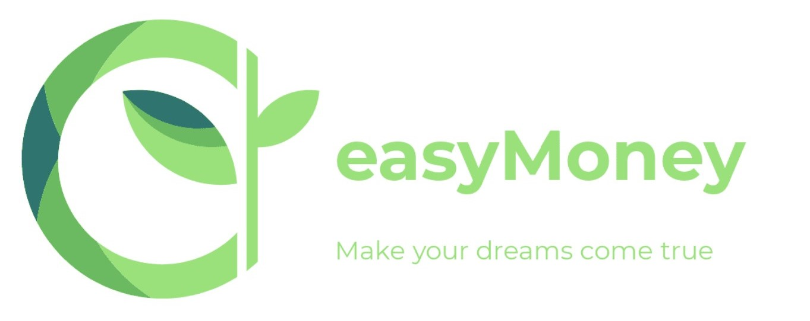

                                                                 

# Proyecto Final del Máster de Data Science. 
## Proyecto easyMoney.
------

    

**Desarrollado por:** [David Cembranos](https://github.com/carlonsk), [Adrian Nora](https://github.com/Harry3lsucio) y [Javier Alfonso](https://github.com/jascicz)

------

El proyecto final corresponde a un roleplay de Data Science donde durante 4 meses nos meteremos en la piel de Bob para trabajar como Data Scientist en una compañía comercializadora de productos financieros. Este proyecto simila un escenario cercano a la realidad de la profesión, en el que los requerimientos están poco (o nada) definidos, y debemos hacer uso de nuestra creatividad para proporcionar soluciones en un área de marketing analítico y desarrollo de negocio desde la analítica avanzada. 

easyMoney nació hace casi 4 años de la imaginación de Carol Denver, una profesional consolidada de la banca de inversión que tras más de 10 años trabajando para grandes firmas decidió lanzar su propio proyecto empresarial: una plataforma multi-canal de comercialización de productos financieros (ahorro, inversión, financiación) con una interfaz amigable en la que los clientes pudiesen encontrar soluciones a sus necesidades financieras y contratarlas de manera sencilla. 

Tras 4 años de actividad, easyMoney se enfrenta a algunos retos que ponen en riesgo su continuidad. En este contexto, y tras la salida de uno de los miembros del equipo de Marketing destinado a la captación, la dirección de easyMoney ha decidido cubrir esa vacante con la incorporación de un Data Scientist, que le ayude en esta nueva etapa a obtener una mejor rentabilidad de la cartera actual de clientes.

El proyecto consiste en 6 tareas:

- [**Tarea 1. Análisis**](./tarea1_Analisis/) En esta tarea se desarrolla un autoservicio de BI para todo el equipo donde poder visualizar altas, bajas, información de los clientes... Haz clic en el [Dashboard](http://carlosperez1697.pythonanywhere.com/analisis) para ver el resultado.

- [**Tarea 2. Segmentación**](./tarea2_Segmentacion/tarea2-segmentacion.ipynb) En esta tarea se realiza una segmentación de nuestra cartera de clientes con el fin de poder orientar nuestra actividad comercial. Los diferentes clusters pueden visualizarse en el siguiente [link](http://carlosperez1697.pythonanywhere.com/segmentacion).

- [**Tarea 3. Recomendación**](./tarea3_Recomendacion/tarea3-recomendaci-n.ipynb) En esta tarea se realiza recomendaciones de productos a 10.000 clientes para ello primero se realizan las recomendaciones y después se pasan por un [Modelo de Compra](./tarea3_Recomendacion/tarea3-modelo-compra.ipynb) para escoger que recomendaciones tendrán más probabilidad de éxito y mayor beneficio ofrecen a la compañía. 
    
    En esta tarea también se tiene en cuenta los [Requerimientos de la plataforma de productivización](./tarea3_Recomendacion/tarea3-produccion-specs.ipynb) para poder operar los modelos desarrollados en este proyecto. 

- [**Tarea 4. Personalización**](./tarea4_Personalizacion/tarea4-personalizacion.ipynb) En esta tarea se realiza una segmentación de los 10.000 emails que resultan de la tarea 3. El objetivo es obtener 4 o 5 creatividades distintas correspondientes a diferentes perfiles en función del perfil de los clientes, según edad, sexo, ingresos, etc.

- [**Tarea 5. Seguimiento**](./tarea5_Seguimiento/tarea5-seguimiento.ipynb) En esta tarea se definen una serie de KPIs para hacer seguimiento de la campaña.

- [**Tarea 6. Coordinación**](./tarea6_Coordinacion/tarea6-coordinaci-n.ipynb) En esta tarea, se determina el proceso de coordinación y validación de los cambios y mejoras que se implementen en los modelos opertativos como en el dashboard. 

El proyecto también puede visualizarse en este [dataset de Kaggle](https://www.kaggle.com/carlosperez97/easymoneygrupo5), ahí se encuentran todos los archivos tanto originales como intermedios; y se pueden ejecutar los notebooks.
